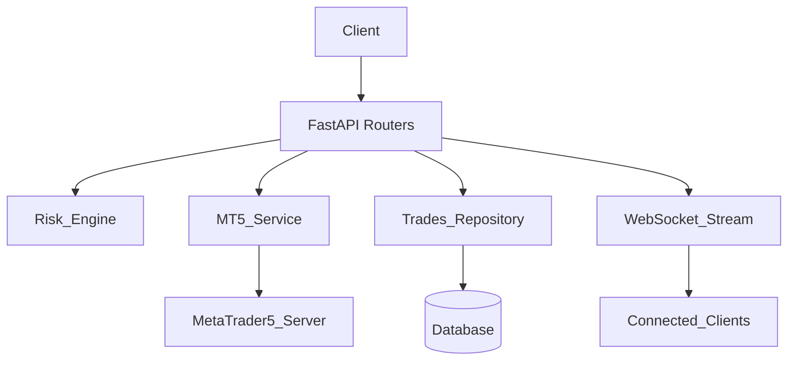

## TradeCore Architecture

### Purpose

`TradeCore` is a FastAPI-based backend that connects to MetaTrader 5 via `mt5linux`, exposes REST and WebSocket APIs for trading and account monitoring, performs risk checks, and persists trades for journaling and analytics.

### High-Level Components

- **Application entrypoint**
  - `run.py`: Starts Uvicorn and serves `app.main:app`.
  - `app/main.py`: Composes the FastAPI app, configures CORS, and registers routers.
- **Core services**
  - `app/services/mt5_service.py`: MT5 connection lifecycle, account/position/price access, and order execution.
  - `app/services/risk_engine.py`: Pre-trade risk checks (symbol allowlist, lot bounds, open position limits, daily loss).
  - `app/services/connection_manager.py` and `app/services/state.py`: WebSocket client tracking and in-memory cache for last-known account, positions, and prices.
- **Persistence**
  - `app/db/base.py` / `app/db/session.py`: SQLAlchemy base and session factory bound to the configured `DB_URL`.
  - `app/models/*.py`: ORM models for trades and signals.
  - Higher-level helpers (being unified) used by trading/journal APIs to store and retrieve trades.
- **API layer**
  - `app/api/account.py`: Account summary endpoint.
  - `app/api/trades.py`: Open/close trade operations, listing of open positions and history.
  - `app/api/journal.py`: Journal view over stored trades.
  - `app/api/logs.py`: Logs endpoint (initially stubbed).
  - `app/api/stream.py`: WebSocket endpoint streaming price, account, and positions.

### Data & Control Flow



1. A frontend client sends HTTP requests (e.g., `POST /trade/open`, `GET /account/summary`) to the FastAPI app.
2. Trade requests pass through `risk_engine` before invoking `mt5_service` to send orders to MetaTrader 5.
3. Executions and closes are persisted via a repository layer backed by SQLAlchemy models.
4. The WebSocket stream polls MT5 for price/account/position updates and broadcasts changes to subscribed clients.

### Configuration

- `app/core/config.py` provides configuration such as:
  - `DB_URL`: Database connection string (defaults to SQLite).
  - `API_KEY`: Optional API key for protected endpoints.
- A future extension is to promote this into a Pydantic `BaseSettings` so risk limits, allowed symbols, and polling intervals can be configured per environment.

### Running TradeCore

#### Local development

1. Install dependencies:

```bash
cd TradeCore
pip install -r requirements.txt
```

2. Set up environment (optional but recommended):

```bash
cp .env.example .env  # if present
# Edit DB_URL, API_KEY, and any MT5 credentials as needed
```

3. Start the API server:

```bash
python run.py
```

The API will be available at `http://127.0.0.1:8000`.

#### With Uvicorn directly

```bash
uvicorn app.main:app --host 0.0.0.0 --port 8000 --reload
```

### Future Enhancements

- Unify persistence around SQLAlchemy with a dedicated repository layer.
- Introduce MT5 interfaces and a configurable risk policy injected via FastAPI dependencies.
- Replace the in-memory `state` cache with an abstraction that can be backed by Redis or similar when scaling out.

