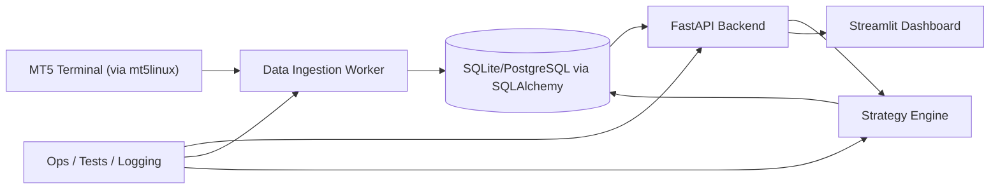

# TradeCore Project Plan

## Vision

TradeCore is a modular trading platform focused on three outcomes:

1. reliable ingestion of market and broker data from MT5,
2. automated strategy execution and signal generation, and
3. clear operational and analytical visibility through a dashboard.

The immediate objective is to deliver a stable MVP that proves end-to-end flow from broker connectivity to API exposure and user-facing monitoring, while keeping architecture simple enough to evolve safely.

## Architecture Overview

TradeCore follows a service-oriented monolith pattern for MVP: one backend service owns API, persistence, and orchestration; ingestion and strategy modules run as internal workers; a separate dashboard consumes backend APIs.

## Component Breakdown

### 1) Data Ingestion

- Connect to MT5 through `mt5linux` (`main.py`, `start_wine.sh`).
- Pull symbol/market/account information and normalize it.
- Persist normalized records for API and strategy consumption.
- Add retries/health checks around broker connectivity.

### 2) Backend API

- FastAPI application entrypoint in `app/main.py`.
- Route modules in `app/api/` (`health`, `trade`, `signal`).
- Runtime served through `run.py` (Uvicorn).
- Exposes read/write endpoints for trades, signals, and operational health.

### 3) Database Layer

- SQLAlchemy engine/session setup in `app/db/session.py`.
- Declarative models in `app/models/` and schemas in `app/schemas/`.
- MVP default is SQLite (`app/core/config.py`), with migration path to PostgreSQL.

### 4) Strategy Engine

- Strategy abstraction seeded in `strategies/base.py`.
- Consumes ingested market data and emits signals/trade intents.
- Strategy execution pipeline should be deterministic and testable.

### 5) Dashboard

- Streamlit UI in `dashboard/app.py`.
- MVP dashboard focuses on service health, basic trade/signal visibility, and system status.
- Pulls data from backend API (no direct database coupling from UI).

### 6) Cross-Cutting Operations

- Health checks via `/health` and tests in `tests/test_health.py`.
- Centralized config in `app/core/config.py`.
- Logging scaffolding in `app/core/logging.py` for observability hardening.

## Technology Stack

- **API framework:** FastAPI
- **ASGI server:** Uvicorn
- **Dashboard:** Streamlit
- **ORM / persistence:** SQLAlchemy (+ SQLite for MVP)
- **Broker integration:** mt5linux
- **Validation / schemas:** Pydantic
- **Testing:** Pytest + FastAPI TestClient
- **Data tooling:** Pandas, Matplotlib (currently used in MT5 integration prototype)

## MVP Scope

MVP includes:

- MT5 connectivity validation and basic market/trade data ingestion.
- FastAPI endpoints for health, signals, and trades with persistent storage.
- Basic strategy loop that produces simple signals from ingested data.
- Streamlit dashboard showing health and core trading metrics.
- Foundational test coverage for health and core data flow smoke checks.
- Local developer run path (`run.py`, dashboard app, ingestion script).

## Out-of-Scope

The first release explicitly does **not** include:

- High-frequency or low-latency execution optimization.
- Multi-broker abstraction beyond MT5.
- Advanced portfolio/risk engine (VaR, stress testing, margin simulation).
- Full authN/authZ, multi-tenant access, or enterprise RBAC.
- Complex UI workflows (custom charting studio, alert builder, reporting suite).
- Auto-scaling distributed workers and production-grade orchestration.
- Native mobile applications.

## Milestones

The project milestones are mapped to Continuum work items where available:

1. **M0 - Architecture Alignment (Current)**
   - Task `#878`: Draft project vision, architecture, and roadmap document.
   - Deliverable: this `docs/project_plan.md`.

2. **M1 - Core Service Skeleton**
   - Extend existing FastAPI routes and DB models into usable CRUD/API contracts.
   - Harden config/loading and baseline logging.
   - Planned Continuum tasks: **to be linked once added to project 33 task list**.

3. **M2 - Ingestion Pipeline MVP**
   - Move MT5 prototype code into a reusable ingestion module/service.
   - Persist normalized ingestion outputs and add failure handling.
   - Planned Continuum tasks: **to be linked once added to project 33 task list**.

4. **M3 - Strategy Loop MVP**
   - Implement minimal strategy execution path on top of ingested data.
   - Expose strategy outputs through API and persist signals.
   - Planned Continuum tasks: **to be linked once added to project 33 task list**.

5. **M4 - Dashboard MVP**
   - Expand Streamlit app to display health, signals, and trade snapshots.
   - Integrate with backend API endpoints.
   - Planned Continuum tasks: **to be linked once added to project 33 task list**.

6. **M5 - Stabilization and Release Readiness**
   - Add smoke/integration tests for ingestion -> strategy -> API -> dashboard path.
   - Finalize MVP release checklist and operational runbook.
   - Planned Continuum tasks: **to be linked once added to project 33 task list**.

## Review Notes

- Reviewer feedback section (required by checklist) should be completed after peer review.
- Suggested review focus: architecture boundaries, MVP scope realism, and milestone sequencing.
